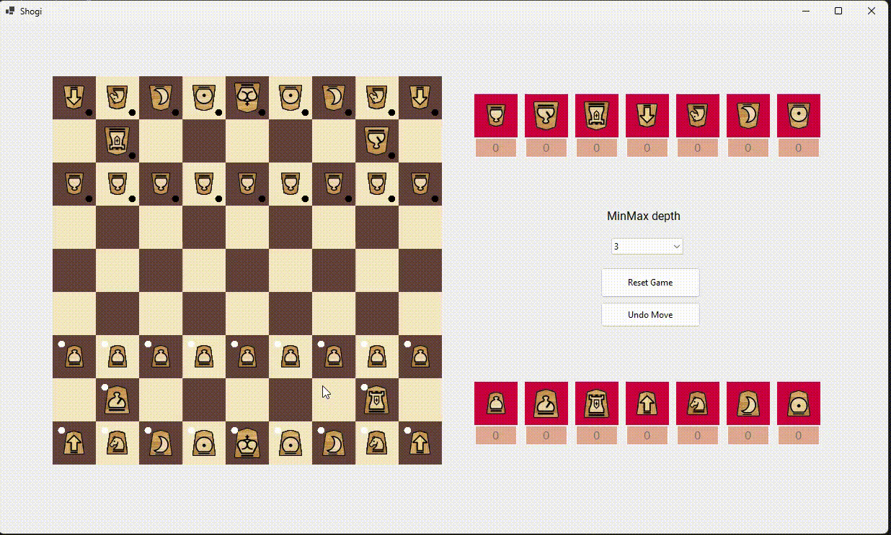

# Shogi MiniMax
Implementation of a Shogi board game in C# using Windows Forms.
The user plays agains a AI that uses the Minimax algorithm to choose the next moves.
The depth of the Minimax search, the dificulty of the AI, can be changed in-game.

## Getting started

## Project Description

  

